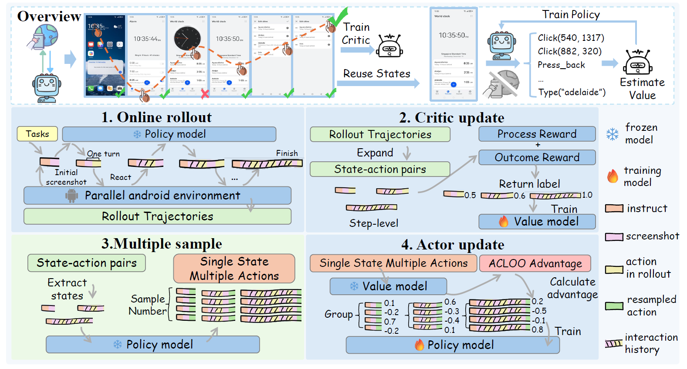

# Android Coach


## Introduction
This repository contains the training code for Android Coach, a framework for online training of Vision-Language Models (VLMs) using a Single State Multiple Actions (SSMA) paradigm.

<p align="center">
  
</p>

## 🛠 Environment Setup
First, use the `docker/Dockerfile` to build the image, then run the container:
```bash
bash docker_run.sh
```
This environment will be configured with emulators for online training.

## ⚙️ Setup for Training
### 1. Prepare PRM (Optional)
   **Training**:
   ```bash
   bash examples/sft/android/sft_prm.sh <nproc_per_node> <save_path>
   ```

   **Inference for Online RL**:
   Deploy trained PRM as a service using vLLM.
   ```bash
   vllm serve YOUR_PRM_PATH --tensor-parallel-size 2 --port 5001 --host 0.0.0.0
   ```
   If you use another node, remember to update the client information in `get_completion_prm` in `verl/trainer/ppo/android.py`.

### 2. Start RL Training

   - Modify `ACTOR_MODEL_PATH`, `PRM_MODEL_PATH`, and `experiment_name` in `examples/acloo_trainer/online_android_train.sh`.
   - To pretrain the critic, set `critic.pretrain_critic` to `True`.
   - Fill `api_key`.
   - Start the training run:
```bash
bash examples/acloo_trainer/online_android_train.sh
```
   
### 3. Outcome
The trained actor and critic models will be saved in Hugging Face format to the `checkpoints/` directory.

### 4. Evaluate
Refer to [AndroidLab](https://github.com/THUDM/Android-Lab) and [AndroidWorld](https://github.com/google-research/android_world) for evaluation methodologies.

## ✅ Key Parameters
- **`actor_rollout_ref.rollout.n`** (`SSMA`, e.g., 4) — Number of candidate actions sampled per state (Single State Multiple Actions).
- **`critic.pretrain_critic`** (`True`/`False`) — Whether to pretrain the Critic on the PRM dataset before RL.
- **`critic.use_prm`** (`True`/`False`) — Whether to use the Process Reward Model for step-level rewards during training.
- **`ACTOR_MODEL_PATH`** / **`PRM_MODEL_PATH`** — Paths to the initial Actor and Critic models (HuggingFace format).
- **`ROLLOUT_BSZ`** (e.g., 8) — Number of parallel environments, also the rollout batch size.
- **`env.max_steps`** (e.g., 16) — Maximum steps per episode.

See the training script for all parameters.

## 🔗 Related Projects
- [VERL](https://github.com/volcengine/verl) - Volcano Engine Reinforcement Learning for LLMs
- [AndroidLab](https://github.com/THUDM/Android-Lab) - Training and Systematic Benchmarking of Android Autonomous Agents
- [AndroidWorld](https://github.com/google-research/android_world) - An environment for building and benchmarking autonomous computer control agents.

---

## 📄 Citation
If you find this work useful, please cite our paper:
```bibtex
@misc{gan2026androidcoachimproveonline,
      title={Android Coach: Improve Online Agentic Training Efficiency with Single State Multiple Actions}, 
      author={Guo Gan and Yuxuan Ding and Cong Chen and Yuwei Ren and Yin Huang and Hong Zhou},
      year={2026},
      eprint={2604.07277},
      archivePrefix={arXiv},
      primaryClass={cs.LG},
      url={https://arxiv.org/abs/2604.07277}, 
}
```
